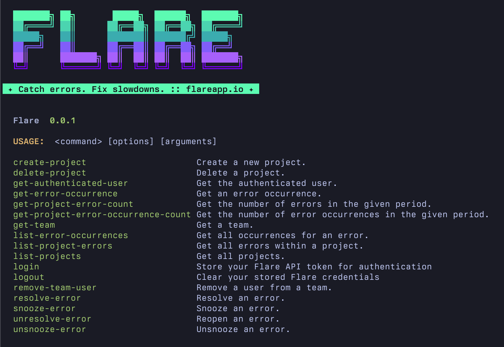

# Flare CLI

[](https://packagist.org/packages/spatie/flare-cli)
[](https://github.com/spatie/flare-cli/actions?query=workflow%3Arun-tests+branch%3Amain)
[](https://github.com/spatie/flare-cli/actions?query=workflow%3A"Fix+PHP+code+style+issues"+branch%3Amain)
[](https://packagist.org/packages/spatie/flare-cli)

A command-line tool for [Flare](https://flareapp.io) — interact with the Flare API from your terminal.



## Installation

```bash
composer global require spatie/flare-cli
```

Make sure Composer's global bin directory is in your `PATH`. You can find the path with:

```bash
composer global config bin-dir --absolute
```

## Usage

### Authentication

```bash
# Log in with your Flare API token
flare login

# Log out
flare logout
```

Get your API token at [flareapp.io/settings/api-tokens](https://flareapp.io/settings/api-tokens).

### Commands

Every Flare API endpoint has a corresponding command. Run `flare list` to see them all, or `flare <command> --help` for details on a specific command.

#### Projects

```bash
# List all projects
flare list-projects

# Create a new project
flare create-project --field name="My App" --field team_id=1 --field stage=production --field technology=Laravel

# Delete a project
flare delete-project --project-id=123
```

#### Errors

```bash
# List errors within a project
flare list-project-errors --project-id=123

# Get error occurrence details
flare get-error-occurrence --error-occurrence-id=456

# List all occurrences for an error
flare list-error-occurrences --error-id=789

# Get error count for a project in a given period
flare get-project-error-count --project-id=123

# Get error occurrence count for a project in a given period
flare get-project-error-occurrence-count --project-id=123

# Resolve an error
flare resolve-error --error-id=456

# Reopen an error
flare unresolve-error --error-id=456

# Snooze an error
flare snooze-error --error-id=456

# Unsnooze an error
flare unsnooze-error --error-id=456
```

#### Teams & Users

```bash
# Get team details
flare get-team --team-id=1

# Remove a user from a team
flare remove-team-user --team-id=1 --user-id=2

# Get the authenticated user
flare get-authenticated-user
```

## Agent Skill

This repository includes an [agent skill](https://skills.sh) that teaches coding agents how to use the Flare CLI.

### Install

```bash
npx skills add spatie/flare-cli
```

## Testing

```bash
composer test
```

## Releasing a new version

1. **Build the PHAR**:

    ```bash
    php flare app:build flare --build-version=1.x.x
    ```

    This bakes the version into `builds/flare`. If you omit `--build-version`, it will prompt you (defaulting to the latest git tag).

2. **Commit and push**:

    ```bash
    git add builds/flare
    git commit -m "Release v1.x.x"
    git push origin main
    ```

3. **Create a release** in the GitHub UI — this creates the tag, triggers Packagist, and automatically updates the changelog.

Users install or update with `composer global require spatie/flare-cli`.

## Changelog

Please see [CHANGELOG](CHANGELOG.md) for more information on what has changed recently.

## Contributing

Please see [CONTRIBUTING](https://github.com/spatie/.github/blob/main/CONTRIBUTING.md) for details.

## Security Vulnerabilities

Please review [our security policy](../../security/policy) on how to report security vulnerabilities.

## Credits

- [Alex Vanderbist](https://github.com/alexvanderbist)
- [All Contributors](../../contributors)

## License

The MIT License (MIT). Please see [License File](LICENSE.md) for more information.
